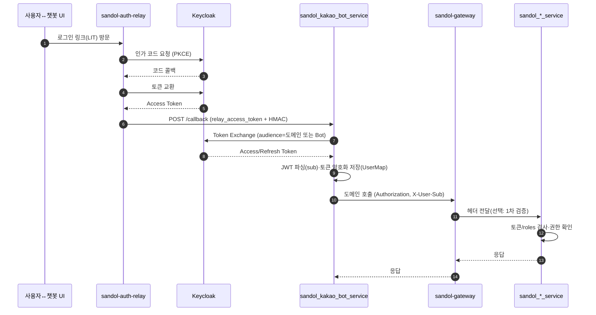

# 챗봇 사용자 컨텍스트 전파 가이드 *(후속 문서)*

> 이 문서는 선행 문서 **[Sandol Auth Relay 기반 챗봇 서버 연동 가이드](./auth-relay-integration.md)**(가칭)에서 완결된 인증 플로우 이후, **획득한 인증 정보를 Sandol MSA 전반에 일관·안전하게 전파**하는 규약을 정의합니다.
> Keycloak/Relay 설정 자체는 선행 문서를 따르며, 본 문서는 **컨텍스트 전파와 권한 판정 패턴**에 집중합니다.

* **대상**: sandol 챗봇/백엔드 개발자, 신규 MSA 개발팀, 인프라/보안 담당자
* **범위**: 인증 토큰 수급 이후 단계(컨텍스트 생성·전파·검증·권한확인)
* **비범위**: Keycloak 클라이언트/스코프/매퍼 구성, Relay 설치·운영(선행 문서 참조)

---

## 1. 전체 구조와 단계 경계

본 문서는 사용자 컨텍스트 전파를 **3개 단계**로 나눕니다. 각 단계의 책임 주체를 고정해 혼선을 줄입니다.

* **A. 인증 획득(선행 문서)**: Auth Relay ↔ Keycloak ↔ 챗봇 서버
* **B. 컨텍스트 생성(출발점)**: `sandol_kakao_bot_service`가 `keycloak_sub`를 확정하고 내부 저장소에 보존
* **C. 컨텍스트 전파(소비)**: Gateway/도메인 MSA로 `Authorization` + `X-User-Sub`를 일관 전달·검증

### 1.1 컴포넌트 역할

| 컴포넌트                     | 책임                                                    | 비고                                                   |
| ------------------------ | ----------------------------------------------------- | ---------------------------------------------------- |
| sandol-auth-relay        | Authorization Code Flow 대행, Relay Access Token 전달     | 선행 문서의 `/issue_login_link`·`/relay/oidc/callback` 흐름 |
| sandol_kakao_bot_service | Relay 콜백 검증, **Token Exchange**, `keycloak_sub` 확정·보관 | **사용자 컨텍스트의 출발점**                                    |
| sandol-gateway           | 외부 라우팅, (선택) 1차 토큰 검증, 헤더 전달                          | OPA/Adapter 도입 지점                                    |
| sandol_*_service         | `Authorization`/`X-User-Sub` 기반 권한 판정·비즈니스 로직         | meal/notice 등                                        |
| Keycloak                 | 토큰 발급/교환, Role/Group/Attribute 관리                     | Realm 예: `Sandori`                                   |

### 1.2 단계별 시퀀스 (로직 경계 표시)



> 경계 규칙: **A단계 산출물**은 *relay_access_token*이며, **B단계에서 TE로 사용 가능한 KC 토큰**을 확보합니다. **C단계**는 *Authorization*과 *X-User-Sub*를 **항상 세트로** 전파·검증합니다.

---

## 2. 표준 계약 (헤더·토큰·데이터 모델)

### 2.1 HTTP 헤더 규약

| 헤더                              |       필수       | 작성 주체         | 설명                                                 |
| ------------------------------- | :------------: | ------------- | -------------------------------------------------- |
| `Authorization: Bearer <token>` |        ✅       | 챗봇 서비스/서비스 계정 | **Keycloak Access Token**(TE/Refresh 결과 또는 서비스 계정) |
| `X-User-Sub`                    |        ✅       | 챗봇 서비스        | 사용자 식별자(Keycloak `sub`)                            |
| `X-Service-Context`             |        ⛔       | 호출자(선택)       | JSON 추가 컨텍스트(역할 요약 등). **민감정보 금지**                 |
| `X-Relay-Signature`             | (Relay→Bot 한정) | Relay         | HMAC 서명(선행 단계용)                                    |

원칙:

* `Authorization` 없거나 무효 ⇒ **401**
* `X-User-Sub` 누락 ⇒ **401** *(서비스 계정 예외는 별정)*
* 권한 부족 ⇒ **403**

### 2.2 스코프/Audience 정책

* **기본 스코프**: `openid profile email offline_access`
* **TE Audience 권장**: 호출 대상 MSA의 Client ID로 교환(최소 권한)

  * 운영 편의상 Bot Audience 공용 사용 가능(초기단계)
* **권한 판별**:

  * 전역: `realm_access.roles` (예: `global_admin`)
  * 도메인: `resource_access[<client_id>].roles` (예: `meal_admin`)

### 2.3 공통 데이터 모델

* 모든 사용자 연관 테이블에 **`keycloak_sub`(문자열, Unique 권장)**
* **토큰 암호화 저장(Fernet 등)**, 만료는 **UTC with TZ**
* 도메인 권한 테이블은 `keycloak_sub` FK로 참조하고 JWT roles와 **AND/OR** 조합

---

## 3. 챗봇 서비스 관점 (컨텍스트의 “출발점”)

### 3.1 필수 구현

* **Relay 콜백 검증**: `X-Relay-Signature` + `ts`/`nonce` 재사용 금지
* **Token Exchange**: `subject_token`=relay_access_token, 필요 시 `audience`/`scope`
* **sub 확정**: JWT 로컬 파싱으로 `sub` 추출(게이트웨이에서 1차 검증 시 *unsafe decode* 허용)
* **보관/재사용**: UserMap Upsert(암호화), 만료 전 Refresh → TE 재수행
* **내부 호출 클라이언트**: 항상 `Authorization` + `X-User-Sub` 부착

### 3.2 실패 처리 매트릭스

| 상황              | 반환/조치                       |
| --------------- | --------------------------- |
| 서명/nonce/ts 불일치 | 400/401 + 보안 로그             |
| TE 실패           | 502 + 원인 로깅                 |
| 암복호화 실패         | 500 + 키 설정 점검               |
| Access 만료       | Refresh→재발급, 실패 시 재인증 링크 안내 |
| Refresh 불가      | 토큰 삭제 후 재로그인 유도             |

### 3.3 테스트 체크리스트

* 콜백 서명/재전송 방지 단위 테스트
* TE 성공/실패(offline_access 포함)
* `sub` 추출·권한 해석
* 암복호화, UserMap upsert
* 만료→Refresh→재시도 통합 테스트
* `X-User-Sub` 누락/roles 부족 시 401/403 확인

---

## 4. 도메인 MSA 적용 (소비자 측 표준)

### 4.1 목표

* 보호 엔드포인트는 **반드시** `Authorization` + `X-User-Sub` 요구
* 사용자 식별/권한의 단일 소스는 **Keycloak(`sub`, `roles`)**

### 4.2 마이그레이션 순서

1. 스키마에 `keycloak_sub` 추가(Unique 권장)
2. **인증 미들웨어**: 토큰 추출·검증(JWKS or 게이트웨이 신뢰)·`sub` 컨텍스트 주입
3. 조회/권한 로직을 `keycloak_sub`·JWT roles 기반으로 교체
4. 내부 HTTP 클라이언트에 표준 헤더 부착
5. `X-User-ID` 제거, 회귀 테스트 작성

### 4.3 배포 전 점검

* 마이그레이션/환경변수(KC_*, TOKEN_ENCRYPTION_KEY) 확인
* 게이트웨이 헤더 전달·보호 규칙 확인
* 서비스 계정 호출 경로(cred grant)와 `X-User-Sub` 정책 확정

---

## 5. 핵심 코드 스니펫 (요지 유지, 인터페이스만 정합)

> 선행 문서의 엔드포인트 명(`POST /issue_login_link`, `POST /callback`)과 동일한 명칭·페이로드를 가정합니다.

**5.1 Relay 콜백 HMAC 검증**

```python
import hmac, hashlib, json, base64

def verify_relay_hmac(secret: str, raw_body: bytes, sig: str) -> bool:
    if not sig:
        return False
    try:
        payload = json.loads(raw_body.decode())
        canonical = json.dumps(payload, sort_keys=True, separators=(',', ':')).encode()
    except json.JSONDecodeError:
        return False
    digest = hmac.new(secret.encode(), canonical, hashlib.sha256).digest()
    calc = base64.urlsafe_b64encode(digest).rstrip(b'=').decode()
    return hmac.compare_digest(calc, sig)
```

**5.2 JWT 클레임 추출(게이트웨이 1차 검증 전제 시)**

```python
import jwt

def extract_claims_unsafe(token: str) -> dict | None:
    try:
        return jwt.decode(token, options={"verify_signature": False})
    except Exception:
        return None
```

**5.3 토큰 암복호화(Fernet)**

```python
from cryptography.fernet import Fernet
import os

fernet = Fernet(os.environ["TOKEN_ENCRYPTION_KEY"].encode())

def enc(s: str) -> str: return fernet.encrypt(s.encode()).decode()
def dec(s: str) -> str: return fernet.decrypt(s.encode()).decode()
```

---

## 6. 운영 보안 수칙

* **평문 토큰 로그 금지**, 저장 시 암호화, 키 로테이션 계획
* **게이트웨이 1차 차단**(Authorization/X-User-Sub 누락) + (선택) JWKS 검증
* **감사 로그 최소화**: `sub`, 경로, 결과코드, 상관ID 정도만
* **E2E 테스트**: Keycloak·Relay·Bot·도메인 MSA를 묶은 시나리오

---

## 7. 부록 (요약)

* **userinfo 필드 예시**: `sub`, `preferred_username`, `email`, `realm_access.roles`, `resource_access.<client>.roles` 등
* **Token Mapper 개념**: Realm/Client Role 매퍼, User Attribute 매퍼(최소화)
* **인증 처리 위치 선택**

  * 게이트웨이 검증: 중앙화·일관성, JWKS 캐시 필요
  * 서비스 검증: 독립성, 중복 방지 위해 공통 라이브러리 권장
  * **권장**: 초기 서비스 검증 → 안정화 후 게이트웨이 1차 검증 추가(이중 방어)
