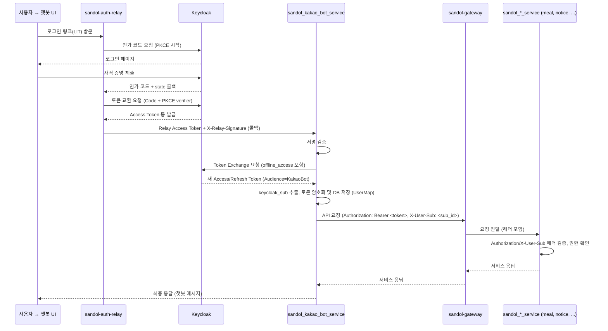

# 챗봇 사용자 컨텍스트 전파 가이드

> 이 문서는 `docs/chatbot-integration-guide.md`에서 정의한 **Auth Relay ↔ Keycloak 연동 절차**를 기반으로, 챗봇이 획득한 인증 정보를 Sandol MSA 전반에 안전하게 전달하는 방법을 정리한 후속 문서입니다.

* **대상 독자**: sandol 챗봇/백엔드 개발자, 신규 MSA 개발 팀, 인프라/보안 담당자
* **포커스**: 인증 자체(Keycloak 설정)보다 **인증된 사용자 컨텍스트를 각 MSA에 일관되게 전파하는 패턴**에 초점을 둡니다.

---

## 1. 전체 그림

### 1.1 컴포넌트 역할 요약

| 컴포넌트                       | 책임                                                   | 비고                                |
| :------------------------- | :--------------------------------------------------- | :-------------------------------- |
| sandol-auth-relay          | Authorization Code Flow 대행, Relay Access Token 전달    | `chatbot-integration-guide.md` 참고 |
| sandol_kakao_bot_service   | Relay 콜백 검증, Token Exchange, 사용자 ↔ Keycloak `sub` 매핑 | **사용자 컨텍스트의 출발점**                 |
| sandol-gateway             | 외부 요청 라우팅, 보조 검증(미들웨어)                               | 향후 OPA/Keycloak adapter 도입 지점     |
| sandol_*_service 등 도메인 MSA | `X-User-Sub` 기반 권한 판단 및 비즈니스 로직                      | 신규 서비스 포함                         |
| Keycloak                   | 토큰 발급/교환, Role/Group/Attribute 관리(단일 소스)             | Realm: `Sandori` (예시)             |

### 1.2 사용자 컨텍스트 흐름



*(참고: 위 다이어그램은 주요 흐름을 나타내며, 게이트웨이의 상세 역할은 구현에 따라 달라질 수 있습니다.)*

---

## 2. 사용자 컨텍스트 표준 계약

### 2.1 HTTP 헤더 규약

| 헤더                              | 필수 | 작성 주체                                     | 설명                                                     |
| :------------------------------ | :- | :---------------------------------------- | :----------------------------------------------------- |
| `Authorization: Bearer <token>` | ✅  | sandol_kakao_bot_service, 서비스 계정          | Keycloak Access Token (Token Exchange 결과 또는 서비스 계정 토큰) |
| `X-User-Sub`                    | ✅  | sandol_kakao_bot_service                  | 사용자 식별자(Keycloak `sub` 클레임 값)                          |
| `X-Service-Context`             | ⛔  | 호출자 서비스 (선택 사항)                           | JSON 직렬화된 부가 정보 (예: 역할 요약, 조직 코드)                      |
| `X-Relay-Signature`             |    | sandol-auth-relay (Relay → KakaoBot 통신 시) | Relay 콜백 요청의 무결성 검증용 HMAC 서명                           |

> **원칙**
>
> * 내부 MSA 진입점(REST API)은 `Authorization` 헤더가 없거나 토큰이 유효하지 않은 경우 **401 Unauthorized**를 반환합니다.
> * `X-User-Sub` 헤더가 없으면 **사용자 컨텍스트가 없는 호출**로 간주하고 **401 Unauthorized**를 반환합니다. (서비스 계정 호출 등 예외 정책 필요 시 별도 정의)
> * 토큰과 `X-User-Sub`는 유효하지만 요청된 작업을 수행할 권한이 부족하면 **403 Forbidden**을 반환합니다.

### 2.2 토큰 스코프 및 Audience

* **기본 Scope**: `openid profile email offline_access`. (`sandol_kakao_bot_service`가 Token Exchange 시 요청)
* **Token Exchange Audience**: `sandol_kakao_bot_service`는 다른 MSA 호출 시, 해당 MSA의 **Keycloak Client ID**를 `audience`로 지정하여 Token Exchange를 수행하는 것을 **권장**합니다 (최소 권한 원칙). 또는, `sandol_kakao_bot_service` 자신의 Client ID로 교환된 토큰을 내부 통신에 공통적으로 사용할 수도 있습니다 (운영 편의성 고려).
* **권한 판별**: JWT 클레임 기반으로 판별합니다.

  * **전역 권한**: `realm_access.roles` 배열 확인 (예: `global_admin` 포함 여부)
  * **도메인 특정 권한**: `resource_access[<client_id>].roles` 배열 확인 (예: `meal_admin` 포함 여부)
  * **사용자 프로필**: 기본 정보(`name`, `email` 등)는 토큰에 포함시키거나, 추가 정보가 필요할 경우 Keycloak `userinfo` 엔드포인트(`Authorization` 헤더 사용)를 호출하여 조회합니다.

### 2.3 데이터 모델 공통 분모 (모든 MSA 해당)

* **사용자 식별**: 사용자와 관련된 모든 테이블/레코드에는 **`keycloak_sub` (문자열 타입, Unique 제약 조건 권장)** 컬럼을 두어 Keycloak 사용자와 명확하게 연결합니다. 기존의 서비스 내부 숫자 ID는 점진적으로 `keycloak_sub`로 대체하거나 병행 관리합니다.
* **토큰 저장 (`sandol_kakao_bot_service` 해당):**

  * Access Token과 Refresh Token은 DB 저장 시 **반드시 암호화**합니다 (예: Python `cryptography.fernet`). `TOKEN_ENCRYPTION_KEY` 환경 변수를 안전하게 관리해야 합니다.
  * 토큰 만료 시각(`access_token_expires_at`, `refresh_token_expires_at`)은 **시간대 정보가 포함된 타임스탬프 타입** (예: PostgreSQL `TIMESTAMP WITH TIME ZONE`)으로 저장하고, UTC 기준으로 관리하는 것을 권장합니다.
* **도메인 권한 관리**: 특정 서비스 내의 역할(예: `sandol_meal_service`의 식당 관리자) 정보는 해당 서비스 DB 내에 `keycloak_sub`를 외래 키(FK)로 참조하는 별도 테이블(예: `meal_service_admins`)을 두어 관리합니다. 최종 권한 판정 시 JWT 클레임의 역할과 이 테이블 정보를 조합하여 사용합니다.

---

## 3. sandol_kakao_bot_service 관점

### 3.1 핵심 구현 포인트

* **Relay 콜백 처리 (`/callback` 엔드포인트):**

  * `X-Relay-Signature` HMAC 서명 검증 (아래 **코드 예시 1** 참고).
  * 타임스탬프(`ts`), Nonce 검증 (재전송 공격 방지).
* **Token Exchange**: Relay로부터 받은 `relay_access_token`과 `offline_access` Scope를 사용하여 Keycloak에 Token Exchange 요청을 보내 새 Access/Refresh Token을 발급받습니다 (`app/services/auth_service.py` 내 구현).
* **Keycloak Sub 추출**: 새로 발급받은 Access Token(JWT)을 **로컬에서 디코딩**하여 `sub` 클레임 값을 추출합니다 (아래 **코드 예시 2** 참고). 불필요한 `/userinfo` API 호출을 지양합니다.
* **토큰 저장**: 추출한 `keycloak_sub`와 `kakao_id`를 키로 사용하여 `UserMap` 테이블에 암호화된 Access/Refresh Token 및 만료 시각을 **Upsert**합니다 (`app/utils/auth_utils.py` 내 `map_keycloak_user_upsert` 함수). 토큰 암호화 유틸리티를 사용합니다 (아래 **코드 예시 3** 참고).
* **MSA간 HTTP 클라이언트**: 다른 Sandol MSA를 호출할 때는, 저장된 (또는 새로 발급/갱신된) 유효한 Access Token을 `Authorization: Bearer <token>` 헤더에, 해당 사용자의 `keycloak_sub` 값을 `X-User-Sub` 헤더에 포함시켜 전송하는 **클라이언트 래퍼 또는 미들웨어**를 구현하여 사용합니다. (기존 `XUserIDClient` 대신 이 규약 준수)
* **권한 확인**: 관리자 기능 등 권한이 필요한 로직 수행 전, 현재 요청 컨텍스트의 Access Token을 디코딩하여 `realm_access.roles` 또는 `resource_access[<client_id>].roles` 클레임을 확인하는 함수를 구현하여 사용합니다.

### 3.2 실패 시나리오 대응

| 상황                               | 처리                                                                 |
| :------------------------------- | :----------------------------------------------------------------- |
| **Relay 서명/타임스탬프/Nonce 검증 실패**   | **401 Unauthorized** 또는 **400 Bad Request** 반환 및 보안 로그 기록          |
| **Token Exchange 실패**            | **502 Bad Gateway** 반환 및 오류 로깅 (Keycloak 서버 문제 가능성)                |
| **토큰 암호화/복호화 실패**                | **500 Internal Server Error** 반환 및 오류 로깅 (암호화 키 설정 확인 필요)          |
| **Access Token 만료 시 (MSA 호출 전)** | 저장된 Refresh Token으로 **새 Access Token 발급 시도** (Token Refresh Grant) |
| **Refresh Token 만료/무효 시**        | DB에서 해당 토큰 정보 제거, 사용자에게 **로그인 링크 재발급 안내** (챗봇 메시지)                 |

### 3.3 테스트 체크리스트

* [ ] Relay 콜백 서명 검증 성공/실패 단위 테스트.
* [ ] Token Exchange 성공/실패 단위 테스트 (`offline_access` 스코프 포함 여부 확인).
* [ ] JWT `sub` 클레임 추출 로직 단위 테스트.
* [ ] 토큰 암호화/복호화 유닛 테스트 (`TOKEN_ENCRYPTION_KEY` 사용).
* [ ] `UserMap` 테이블 Upsert 로직 단위 테스트 (신규/기존 사용자).
* [ ] Access Token 만료 시 Refresh Token을 사용한 재발급 로직 통합 테스트.
* [ ] `X-User-Sub` 누락, 토큰 만료, 권한 없음 상태에서 다른 MSA 호출 시 예상되는 오류(401/403) 처리 검증.

---

## 4. 도메인 MSA (신규 또는 기존) 적용 가이드

### 4.1 전환 목표

* 모든 인증된 API 요청은 `Authorization: Bearer <token>` 헤더와 `X-User-Sub` 헤더를 필수로 요구하도록 변경합니다.
* 사용자 식별 및 권한 확인의 **단일 소스(Single Source of Truth)**는 Keycloak(`sub` 클레임, `roles` 클레임)으로 통일합니다. 외부 User API 의존성을 제거합니다.

### 4.2 마이그레이션 단계 (기존 MSA의 경우)

1. **DB 스키마 변경**:

   * 사용자 관련 테이블(예: `User`, `MealOwner` 등)에 `keycloak_sub` (문자열, Unique 권장) 컬럼을 추가합니다.
   * **사용 중인 프레임워크나 언어에서 제공하는 표준 데이터베이스 마이그레이션 도구**(예: Alembic, Django Migrations, TypeORM Migrations 등)를 사용하여 스키마 변경을 적용합니다.
   * 기존의 내부 숫자 ID 기반 외래 키(FK) 관계는 점진적으로 `keycloak_sub` 기반으로 전환하거나, 매핑 테이블을 활용하는 것을 고려합니다.
2. **인증 미들웨어/데코레이터 구현**:

   * 모든 보호된 엔드포인트 진입 전에 실행될 미들웨어 또는 데코레이터를 구현합니다.
   * 이 미들웨어는 `Authorization` 헤더에서 Bearer 토큰을 추출하고, `X-User-Sub` 헤더 값을 읽습니다.
   * **(옵션 C 참고)** 필요 시, 토큰의 유효성(서명, 만료, audience 등)을 Keycloak JWKS 엔드포인트에서 공개 키를 가져와 검증합니다. 게이트웨이에서 이미 검증했다면 이 단계를 생략할 수 있습니다.
   * 검증된 `keycloak_sub` 값을 요청 컨텍스트(예: `request.state.user_sub`)에 저장하여 후속 로직에서 사용하도록 합니다.
   * 헤더 누락 또는 토큰/`sub` 불일치 시 401 오류를 반환합니다.
3. **사용자 조회 로직 변경**:

   * 기존에 내부 숫자 ID로 사용자를 조회하던 로직을, 요청 컨텍스트에 저장된 `keycloak_sub`를 사용하여 조회하도록 변경합니다.
4. **권한 확인 로직 변경**:

   * JWT 토큰을 직접 파싱하여 `realm_access.roles` 및 `resource_access[<client_id>].roles` 클레임을 확인하는 방식으로 변경합니다 (위 **코드 예시 2** 참고).
   * 도메인 특정 권한(예: 식당 관리자)은 해당 서비스 DB 내의 권한 테이블에서 `keycloak_sub`를 기준으로 조회하여, JWT 역할과 조합하여 최종 권한을 판정합니다.
5. **내부 HTTP 클라이언트 수정**:

   * 다른 Sandol MSA를 호출하는 내부 HTTP 클라이언트 로직이 있다면, `Authorization` 헤더와 `X-User-Sub` 헤더를 포함하도록 수정합니다. (기존 `XUserIDClient` 패턴 제거)
6. **`X-User-ID` 제거**: 코드베이스 전체에서 `X-User-ID` 관련 로직을 찾아 `X-User-Sub` 기반으로 수정하거나 제거합니다.
7. **테스트**:

   * `Authorization`/`X-User-Sub` 헤더 누락, 잘못된 토큰, `sub` 불일치, 토큰 만료, 역할 부족 등 다양한 시나리오에 대한 통합 테스트 케이스를 작성하여 검증합니다.

### 4.3 배포 전 점검

* [ ] 새 스키마에 대한 데이터베이스 마이그레이션이 성공적으로 적용되었는지 확인합니다.
* [ ] 환경 변수(`TOKEN_ENCRYPTION_KEY` (필요시), `KC_*` 변수 등)가 올바르게 설정되었는지 확인합니다.
* [ ] API 게이트웨이(Nginx 등) 설정에서 `Authorization` 및 `X-User-Sub` 헤더가 MSA로 올바르게 전달되는지 확인합니다.
* [ ] 서비스 계정(백그라운드 작업 등) 호출 시, Keycloak Client Credentials Grant 등을 사용하여 발급받은 유효한 토큰과 적절한 `X-User-Sub`(예: "service-account")를 사용하는지 확인합니다.

---

## 5. 핵심 로직 코드 예시 (Python)

아래는 다양한 프레임워크에서 공통적으로 필요할 수 있는 핵심 로직의 Python 예시입니다.

### 코드 예시 1: Relay 콜백 HMAC 서명 검증

```python
import hmac
import hashlib
import json
import base64
from fastapi import Request, HTTPException, status # 예시 (프레임워크 따라 다름)

# Relay와 동일한 시크릿 키 (환경 변수 등에서 로드)
RELAY_SECRET = "your_relay_to_chatbot_hmac_secret" 

def verify_relay_hmac(secret: str, message_body: bytes, provided_signature: str) -> bool:
    """Relay가 보낸 요청 본문의 HMAC-SHA256 서명을 검증합니다."""
    if not provided_signature:
        return False
        
    # 중요: 메시지 정규화 방식은 Relay의 sign_payload 함수와 정확히 일치해야 함
    # 예: 키 정렬 후 공백 없이 JSON 직렬화
    try:
        payload_dict = json.loads(message_body.decode())
        # separators=(',', ':') : JSON 문자열에서 공백 제거
        # sort_keys=True : 키를 기준으로 정렬하여 일관된 문자열 생성
        canonical_message = json.dumps(payload_dict, sort_keys=True, separators=(',', ':')).encode('utf-8')
    except json.JSONDecodeError:
        return False # 잘못된 JSON 형식

    digest = hmac.new(secret.encode('utf-8'), canonical_message, hashlib.sha256).digest()
    # Relay는 base64url 인코딩을 사용함
    calculated_signature = base64.urlsafe_b64encode(digest).rstrip(b'=').decode('utf-8') 

    return hmac.compare_digest(calculated_signature, provided_signature)

# 사용 예시 (FastAPI 미들웨어 또는 라우터)
# async def verify_signature_middleware(request: Request, call_next):
#     if request.url.path == "/callback": # 콜백 경로에만 적용
#         x_relay_signature = request.headers.get("x-relay-signature")
#         body_bytes = await request.body()
#         # 원본 body를 다시 request에 설정 ( 중요! )
#         request._body = body_bytes 
#         if not verify_relay_hmac(RELAY_SECRET, body_bytes, x_relay_signature):
#             return JSONResponse(status_code=status.HTTP_401_UNAUTHORIZED, content={"error": "Invalid signature"})
#     response = await call_next(request)
#     return response
```

### 코드 예시 2: JWT 파싱 및 클레임 추출 (서명 검증 X)

```python
import jwt # PyJWT 라이브러리 필요

def extract_claims_unsafe(token: str) -> dict | None:
    """JWT 서명을 검증하지 않고 페이로드 클레임을 디코딩합니다."""
    try:
        # verify_signature=False 옵션 사용
        payload = jwt.decode(token, options={"verify_signature": False})
        return payload
    except jwt.DecodeError as e:
        print(f"JWT Decode Error: {e}")
        return None
    except Exception as e:
        print(f"An unexpected error occurred: {e}")
        return None

# 사용 예시
# access_token = "ey..." # Authorization 헤더에서 추출한 토큰
# claims = extract_claims_unsafe(access_token)
# if claims:
#     keycloak_sub = claims.get("sub")
#     realm_roles = claims.get("realm_access", {}).get("roles", [])
#     resource_roles = claims.get("resource_access", {}).get("your_client_id", {}).get("roles", [])
#     if keycloak_sub and "global_admin" in realm_roles:
#         print(f"User {keycloak_sub} is a global admin.")
# else:
#     print("Failed to decode token.")
```

**주의:** 이 방식은 토큰의 위변조를 검증하지 않으므로, **API 게이트웨이 등 신뢰할 수 있는 컴포넌트에서 이미 토큰 서명과 유효성 검증을 완료했다고 확신**할 수 있을 때만 사용해야 합니다. 서비스 자체에서 검증해야 한다면 JWKS를 이용한 서명 검증 로직이 추가되어야 합니다.

### 코드 예시 3: 토큰 암호화/복호화 (Fernet)

```python
from cryptography.fernet import Fernet # cryptography 라이브러리 필요
import os

# 환경 변수 등에서 32바이트 base64 인코딩된 키 로드
# 예: key = Fernet.generate_key() 로 생성 후 환경 변수에 저장
ENCRYPTION_KEY = os.getenv("TOKEN_ENCRYPTION_KEY") 
if not ENCRYPTION_KEY:
    raise ValueError("TOKEN_ENCRYPTION_KEY is not set!")
    
fernet = Fernet(ENCRYPTION_KEY.encode('utf-8'))

def encrypt_data(data: str) -> str:
    """문자열 데이터를 암호화합니다."""
    if not data:
        return ""
    return fernet.encrypt(data.encode('utf-8')).decode('utf-8')

def decrypt_data(encrypted_data: str) -> str:
    """암호화된 문자열 데이터를 복호화합니다."""
    if not encrypted_data:
        return ""
    try:
        return fernet.decrypt(encrypted_data.encode('utf-8')).decode('utf-8')
    except Exception as e:
        print(f"Decryption failed: {e}")
        # 오류 처리: 로깅, 예외 발생 등
        raise ValueError("Failed to decrypt data") from e

# 사용 예시
# refresh_token = "ey..."
# encrypted_rt = encrypt_data(refresh_token)
# print(f"Encrypted: {encrypted_rt}")
# decrypted_rt = decrypt_data(encrypted_rt)
# print(f"Decrypted: {decrypted_rt}")
```

---

## 6. 운영 및 보안 모범 사례

* **토큰 관리**: Access/Refresh Token은 **절대 로그에 평문으로 남기지 마세요.** DB 저장 시 암호화하고, 필요시 주기적인 암호화 키 로테이션을 계획합니다.
* **모니터링**: Token Exchange 실패율, 토큰 만료로 인한 401 응답 비율, 재로그인 요청 빈도 등을 모니터링하여 이상 징후를 조기에 감지합니다.
* **게이트웨이 방어선**: API 게이트웨이(Nginx/OpenResty 등)에서 `Authorization` 또는 `X-User-Sub` 헤더가 없는 요청을 1차적으로 차단하거나, Lua 스크립트, OPA(Open Policy Agent) 등을 활용해 기본적인 토큰 유효성 검사를 수행하는 것을 고려합니다.
* **감사 로그**: 사용자 행위 추적 시, 개인정보 노출을 최소화하기 위해 `keycloak_sub`, 요청 경로, IP 주소, 결과 코드 등 **필수적인 정보** 위주로 로깅합니다.
* **테스트 환경**: `docker-compose`나 `Testcontainers` 등을 활용하여 Keycloak, Auth Relay, 대상 MSA를 함께 구성한 통합 테스트 환경을 구축하여 엔드투엔드 시나리오를 검증합니다.

---

## 7. 참고 자료

* `docs/guides/chatbot-integration-guide.md` (Auth Relay ↔ Keycloak 초기 연동 플로우)
* `sandol_kakao_bot_service/app/utils/auth_utils.py` (또는 관련 유틸 파일 - 구현 참고)
* `sandol_kakao_bot_service/app/services/auth_service.py` (구현 참고)
* Keycloak 공식 문서: [https://www.keycloak.org/documentation](https://www.keycloak.org/documentation)

---

## 부록 A. Keycloak userinfo 응답 형식 예시

아래는 userinfo 엔드포인트에서 반환될 수 있는 대표 필드를 설명하는 형식 예시입니다. 실제 항목은 Realm·클라이언트 설정(Mapper)에 따라 달라질 수 있습니다.

* sub: 사용자의 고유 식별자(예: "2f1a...e9").
* preferred_username: 사용자 표시 이름(예: "jane.doe").
* email: 이메일 주소(예: "[jane@example.com](mailto:jane@example.com)").
* email_verified: 이메일 검증 여부(예: true/false).
* name: 전체 이름(예: "Jane Doe").
* given_name: 이름(예: "Jane").
* family_name: 성(예: "Doe").
* realm_access.roles: 전역 역할 목록(예: ["global_admin", "member"]).
* resource_access.<client_id>.roles: 특정 클라이언트에 대한 역할 목록(예: ["meal_admin"]).
* custom attributes: 필요 시 사용자 속성을 Claim으로 매핑하여 포함(예: 조직, 캠퍼스, 학과 등).

권장 사항

* 토큰에 필요한 최소 정보만 포함시켜 크기를 관리합니다.
* 개인정보 최소화 원칙을 지키고, 민감 정보는 userinfo 호출 또는 내부 DB 보강으로 대체합니다.

## 부록 B. Token Mapper 설정 예시(개념)

Keycloak에서 토큰 또는 userinfo에 포함할 Claim을 구성하기 위한 일반적인 Mapper 설정 항목입니다. 아래는 개념적 예시이며, 실제 UI 경로와 명칭은 Keycloak 버전에 따라 다를 수 있습니다.

* 전역 역할 매핑(Realm Roles → access token)

  * Mapper Type: Realm Role
  * Token Claim Name: realm_access.roles
  * Add to access token: 예
  * Multivalued: 예
  * Claim JSON Type: String

* 클라이언트 역할 매핑(Client Roles → access token)

  * Mapper Type: Client Role
  * Client: 대상 클라이언트 ID(예: meal-service)
  * Token Claim Name: resource_access.<client_id>.roles
  * Add to access token: 예
  * Multivalued: 예

* 사용자 속성 매핑(User Attribute → token/userinfo)

  * Mapper Type: User Attribute
  * User Attribute: 예: department
  * Token Claim Name: department
  * Add to access token / userinfo: 필요에 따라 선택
  * Claim JSON Type: String

* 표준 프로필 클레임 매핑

  * preferred_username, email, name, given_name, family_name 등은 내장 Mapper 또는 표준 프로토콜 매퍼로 활성화

구성 팁

* access token·id token·userinfo 중 어디에 포함할지를 서비스 요구에 따라 최소화합니다.
* Mapper 변경 시 토큰 캐시 무효화 전략과 배포 창구(예: 롤링 업데이트)를 고려합니다.

## 부록 C. 인증 처리 위치 옵션(게이트웨이 vs 서비스)

게이트웨이에서 JWT를 검증할지, 각 서비스에서 자체 검증할지 확정 전제에 따라 두 가지 옵션을 병행 가능한 구조로 제시합니다.

옵션 1) 게이트웨이에서 JWT 검증

* 기대 동작

  * Authorization 헤더에서 토큰 추출.
  * JWKS(예: `<KC_SERVER_URL>/realms/<realm>/protocol/openid-connect/certs`)를 주기적으로 캐시하고 `kid`로 공개키 선택.
  * 서명 알고리즘(예: RS256), `exp/nbf/iat` 시간 유효성 검증.
  * `iss`·`aud` 등 필수 클레임 일치 확인.
  * 검증 성공 시 다운스트림으로 요청 전달, 필요 시 `X-User-Sub` 헤더 설정.
* 운영 포인트

  * JWKS 캐시 만료·로테이션 처리.
  * 실패 시 401/403을 일관되게 반환.
  * 서비스 측에서 재검증이 필요 없는지 정책으로 명확화.

옵션 2) 서비스 내부에서 JWT 검증

* 기대 동작

  * 각 서비스의 인증 미들웨어에서 Authorization 헤더 확인.
  * 토큰 헤더의 `kid`를 사용해 JWKS에서 공개키 선택(캐시 필수).
  * 서명·만료·발급자·대상자 검증.
  * 역할 확인: `realm_access.roles`(전역), `resource_access[<client_id>].roles`(도메인).
  * `sub`를 사용자 컨텍스트의 1차 키로 사용.
* 운영 포인트

  * JWKS 캐시 공유 또는 공통 라이브러리 사용으로 중복 최소화.
  * 게이트웨이 검증이 없다면 서비스 레벨에서 반드시 전 항목을 검증.

권장 전략

* 초기에는 서비스 내부 검증을 우선 적용해 아키텍처 의존을 줄이고, 운영 성숙도에 따라 게이트웨이 1차 검증을 추가해 이중 방어를 구성합니다.
* 어떤 경우든 `X-User-Sub` 헤더만 신뢰하지 말고 JWT 서명과 클레임 검증 결과에 근거해 권한을 판단합니다.
